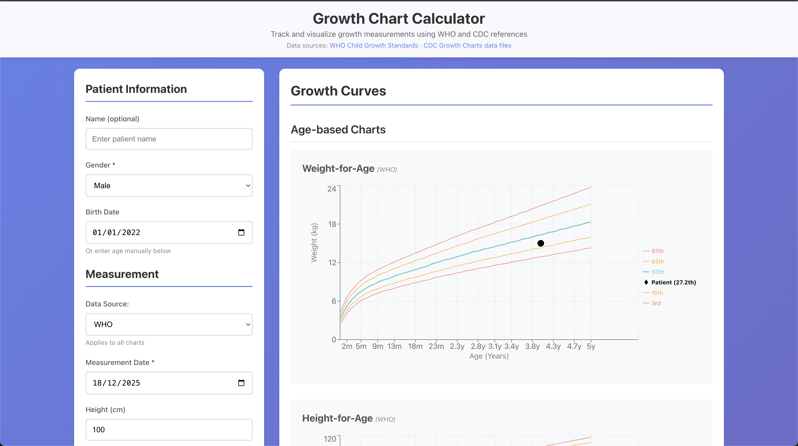

# Growth Charts Calculator

A web application for visualizing child growth measurements using WHO and CDC growth reference standards.

## Data Sources

Growth reference data from:
- [WHO Child Growth Standards](https://www.who.int/tools/child-growth-standards/standards)
- [CDC Growth Charts](https://www.cdc.gov/growthcharts/cdc-data-files.htm)

## License

This software is licensed under the MIT License - see the [LICENSE](LICENSE) file for details.

This project uses growth reference data from WHO and CDC. The data files are subject to the respective organizations' terms of use:
- **WHO**: Requires attribution and prohibits commercial use without authorization. See [WHO data policy](https://www.who.int/about/policies/publishing/data-policy/terms-and-conditions).
- **CDC**: Public domain with attribution required. See [CDC website usage](https://www.cdc.gov/other/agencymaterials.html).

## Disclaimer

This tool is for informational purposes only. Always consult with healthcare professionals for medical decisions regarding child growth and development.
